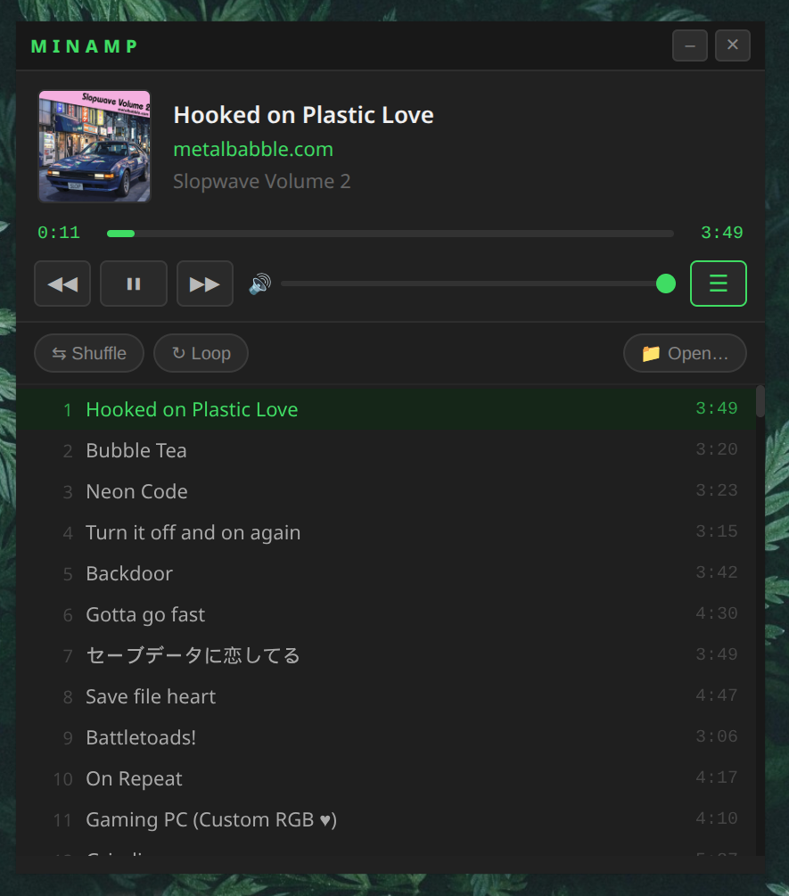

# MinAmp

A lightweight, cross-platform audio player built with Electron. Inspired by the simplicity of classic media players.



▶️ Releases: [Download MinAmp](https://github.com/metalbabble/MinAmp/releases) for Mac, Windows, and Linux.

## Features

- Plays MP3, FLAC, OGG, WAV, M4A, AAC, Opus, and WMA files
- Displays track title, artist, album, and album art from ID3/metadata tags
- Folder and M3U playlist support
- Expandable playlist view with shuffle and loop
- Drag-and-drop files, folders, or playlists onto the window
- Remembers the last loaded source and track position between sessions

## Requirements

- [Node.js](https://nodejs.org/) (v18 or later)

## Getting Started

```bash
npm install
npm start
```

## Usage

### Opening music

- **On first launch**, an open menu appears automatically — choose a folder, M3U playlist, or individual files.
- **Drag and drop** a folder, M3U file, or audio files directly onto the window at any time.
- **App menu** (MinAmp → Open Folder / Open Playlist / Open File(s)) works from the menu bar.
- **Playlist panel** has its own Open… button.

### Controls

| Control | Action |
| ------- | ------ |
| ▶ / ⏸ | Play / Pause |
| ⏮ | Previous track (or restart current if >3 s in) |
| ⏭ | Next track |
| Seek bar | Click anywhere to jump |
| Volume | Drag the slider |
| ☰ | Toggle playlist panel |

### Playlist panel

Click **☰** to expand the window and reveal the track list. From here you can:

- **Double-click** any track to play it immediately
- Toggle **Shuffle** (Fisher-Yates order, current track plays first)
- Toggle **Loop** (restarts playlist from the beginning when the last track ends)

## Building

Packaged builds are produced with [electron-builder](https://www.electron.build/).

```bash
npm run build:mac       # → dist/  .dmg  (arm64 + x64)
npm run build:win       # → dist/  .exe  NSIS installer (x64)
npm run build:linux     # → dist/  .AppImage (x64)
npm run build:linux:arm # → dist/  .AppImage (arm64)
npm run build:all       # all three
```

The resulting files land in `dist/` and are double-clickable installers/bundles. Each build registers MinAmp as an "open with" handler for audio files (mp3, flac, ogg, wav, m4a, aac, opus, wma) and playlists (m3u, m3u8). Dragging any of those — or a folder — onto the app icon launches MinAmp and loads it immediately.

### Platform notes

| Platform | Output | Best built on |
| -------- | ------ | ------------- |
| macOS | `.dmg` with drag-to-Applications | macOS |
| Windows | NSIS `.exe` installer | Windows or Linux (via Wine) |
| Linux | `.AppImage` | Linux or macOS |

Cross-compilation works for most targets but macOS `.dmg` and `.icns` icon generation require running on macOS. For CI, use a matrix of three runners (one per OS) — e.g. GitHub Actions with `macos-latest`, `windows-latest`, and `ubuntu-latest`.

### Icon

The app icon is `icon.png` in the project root. electron-builder converts it automatically to `.icns` (macOS), `.ico` (Windows), and `.png` (Linux) during the build. Use a square image of at least 512×512px for best results.

### CI

GitHub workflow to build Mac, Linux, and Windows versions is set up using [.github/workflows/release.yml](.github/workflows/release.yml)
```
git tag v0.1.0  # or whatever version #
git push origin main --tags
```

## Project Structure

```text
MinAmp/
├── main.js          # Electron main process, IPC handlers, metadata via music-metadata
├── preload.js       # Secure contextBridge IPC bridge
└── renderer/
    ├── index.html   # UI markup
    ├── renderer.js  # Playback logic, UI state, drag-and-drop
    └── styles.css   # Dark theme
```

## More Info
Version history / change log available here: [CHANGELOG.md](CHANGELOG.md)

## License

MIT
